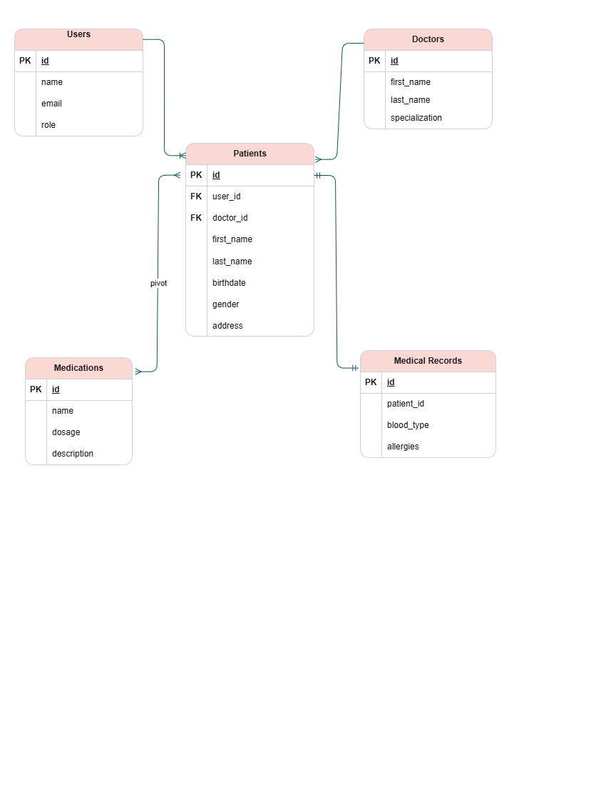
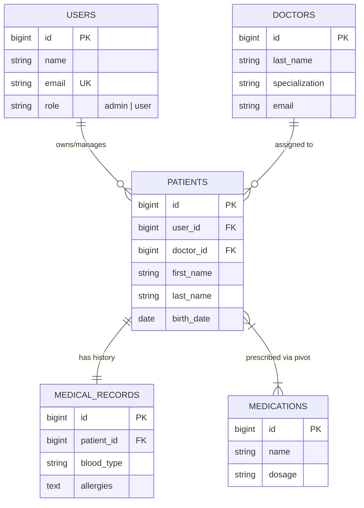

#  Healthcare Management System 

A Laravel 11 application built for the **Middleware + CRUD Integration Activity**. This system manages Patients, Doctors, and Medications while enforcing strict Role-Based Access Control (RBAC) and data ownership.

---

## 📊 Entity Relationship Diagram (ERD)

This system utilizes Eloquent relationships (1:1, 1:M, and M:M) to connect healthcare entities.





---

## ✅ Activity Requirements Checklist

### 1. Build CRUD + UI
- [x] **Full CRUD:** Implemented complete Create, Read, Update, and Delete for **Patients**, **Doctors**, and **Medications**.
- [x] **Eloquent Relationships:** Used native Eloquent methods (`belongsTo`, `hasOne`, `belongsToMany`) with no manual SQL joins.
- [x] **Eager Loading:** Used `with()` in controllers (e.g., `Patient::with('doctor')`) to optimize database performance and prevent N+1 issues.
- [x] **Modern UI:** Styled with Tailwind CSS, featuring Stat Cards on the dashboard and a professional navigation bar.

### 2. Apply Access Rules (Middleware)
- [x] **Authenticated Access:** Used `auth` middleware to protect all healthcare entities.
- [x] **Admin-Only Management:** Created `IsAdminMiddleware` to restrict the **Manage Users** page to administrators only.
- [x] **Data Ownership:** Implemented logic where Users can **only** view and manage the specific Patients they created (`where('user_id', auth()->id())`).
- [x] **Account Security:** Users can only view and manage their own Profile through the Laravel Breeze system.

### 3. UI Behavior
- [x] **Conditional Buttons:** Edit and Delete actions are hidden from regular users in the Doctor and Medication lists.
- [x] **Dynamic Navigation:** The "Manage Users" link only appears in the menu when logged in as an Admin.
- [x] **Professional UX:** Restored the Breeze dropdown for logout and profile management for a cleaner interface.

---

## 🛠️ Installation & Setup

1. **Clone the repository:**
   ```bash
   git clone https://github.com/currlei/healthcare_system.git
   cd healthcare_system
   ```

2. **Install dependencies:**
   ```bash
   composer install
   npm install
   ```

3. **Database Setup (SQLite):**
   - Create a file at `database/database.sqlite`.
   - Update your `.env` file:
     ```env
     DB_CONNECTION=sqlite
     # Use absolute path if necessary
     DB_DATABASE=C:\your\path\to\database\database.sqlite
     ```

4. **Wipe & Seed (Generate 10 random items per table):**
   ```bash
   php artisan migrate:fresh --seed
   ```

5. **Run the App:**
   ```bash
   # In terminal 1
   php artisan serve
   
   # In terminal 2
   npm run dev
   ```

---

## 🔐 Test Credentials

Use these accounts to verify the **Role-Based Access Control**:

| Role | Email | Password | Access Level |
| :--- | :--- | :--- | :--- |
| **Admin** | `admin@gmail.com` | `password123` | Full Access (Can edit/delete everything + Manage Users) |
| **User** | `user@gmail.com` | `password123` | Restricted Access (Own Patients only + Read-only Doctors/Meds) |

---

## 📁 Technical Summary
- **Framework:** Laravel 11
- **UI Framework:** Tailwind CSS & Blade
- **Auth:** Laravel Breeze
- **Middleware:** `app/Http/Middleware/IsAdminMiddleware.php`
- **Logic:** Custom ownership checks in `PatientController.php`
- **Seeding:** Factories used for 10 random Doctors, 10 Patients, and 10 Medications.
```
